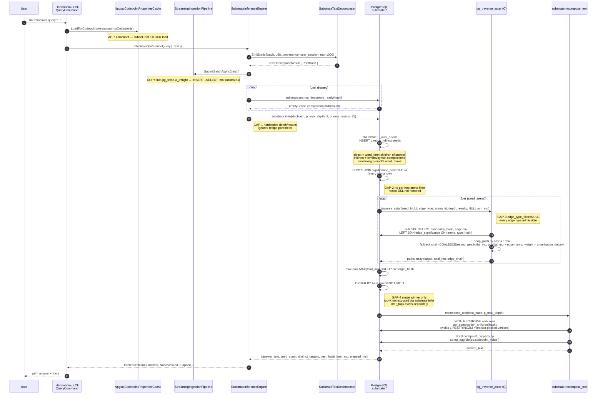

# Flow audit — Inference

**Method.** Both docs and code in this repo were written by prior Claude instances and are independently corruptible. Neither is the source of truth. The substrate's *invention* is the source of truth — every layer of analysis below triangulates **Invention → Doc → Code → Reconciliation needed**. Where the three don't jive, the invention wins and both doc and code are reconciliation candidates.

**Invention, first-principles.** Inference is bounded indexed A* over Glicko-2-rated typed attestation edges between BLAKE3-content-addressed entities. The prompt becomes substrate content; its content-addressed entities ARE the seeds; traversal cost is 1/mu in the requested arena's btree-indexed edge_significance row; the answer is byte-for-byte walked from the winning composition's codepoint leaves via mantissa-packed LINESTRINGZM physicality. No matmul. No sampling. No generation in the LLM sense. Honest abstention when no path clears threshold.

---

## Sequence diagram (current code, with gap callouts)

---

## Per-step triangulation

### Step 0 — Prompt → substrate content

| Lens | Position |
|---|---|
| **Invention** | The prompt is content. It decomposes via the same text path every text-bearing source uses. Its word_form entities ARE the traversal seeds. There is no separate query construction. |
| **Doc** | docs/specs/engine/inference.md §Step 0; AP-6 (prompt-as-query confusion is banned). Provenance = `user_session`, trust mu = 1000.0 (lowest prior). |
| **Code** | `SubstrateInferenceEngine.cs:73-89` invokes `SubstrateTextDecomposer.EmitStatic(batch, utf8, ProvenanceCode="user_session", TopEntityType="text_composition", TrustMu=1000.0)`. Aligned. |
| **Reconciliation** | None — invention, doc, code all jive on this step. ✓ |

### Step 1 — Drain barrier

| Lens | Position |
|---|---|
| **Invention** | The pipeline's drain is asynchronous; inference must wait until the prompt's entities AND physicality have actually landed in the substrate tables before seed activation can read them. |
| **Doc** | Not directly specified; implied by Substrate Law 12 (every composition carries correct edges before consumers read it). |
| **Code** | `SubstrateInferenceEngine.WaitForDocumentAsync` polls `substrate.prompt_document_ready(hash)` until both `entityCount > 0 AND compositionChildCount > 0`, max 5 min @ 50ms. Function source not yet inspected by this audit. |
| **Reconciliation** | Polling-based drain barrier is correct but inelegant — a publish/subscribe signal from the drain workers to interested consumers would match the Gödel engine's message-queue framing per `.claude/rules/35-inference-and-godel.md`. Mark as `partial-correct` — works, but not the substrate's stated architecture. Audit needs to read `prompt_document_ready.sql` to confirm what it checks. |

### Step 2 — Seed activation (two-tier)

| Lens | Position |
|---|---|
| **Invention** | The prompt's content entities are the seeds. The substrate's accumulated content becomes reachable from those seeds via the typed edge graph. Without bridge edges into the rich semantic graph (lemma/synset parents), prompt seeds sit in isolation in word_form↔word_form space only. |
| **Doc** | docs/specs/engine/inference.md §Step 1 says "the prompt's entities are already in substrate; they ARE the seeds — no query construction step is needed." Does NOT explicitly call out the indirect-parent lookup. |
| **Code** | `infer.sql:48-70` does direct seeds (word_form composition children of prompt) UNION indirect seeds (composition_parents of those word_forms, filtered to lemma/synset entity_type). The indirect-parents lookup is the bridge into accumulated semantic content. |
| **Reconciliation** | The code is more correct than the doc — the indirect-parents lookup is load-bearing for non-trivial inference and the doc undersells it. **Action:** doc needs an §"Two-tier seed activation" subsection that explains why composition_parents() is called and what entity_types are admitted (currently hardcoded to {lemma, synset}). Code is also potentially incomplete — what about morpheme parents? text_composition parents? `entity_type IN ('lemma', 'synset')` is a hardcoded subset of admissible parent types; per AP-1 (arena cherry-picking) this is the structural analog — hardcoding a subset of indirect-seed parent types is wrong if the substrate has other semantic-bridge entity_types. **Gap:** the hardcoded {lemma, synset} parent filter is itself an MVP-style cut. |

### Step 3 — Cross-arena fan-out

| Lens | Position |
|---|---|
| **Invention** | Open-vocabulary arenas. Recipe DSL drives per-hop arena filtering and edge-type filtering. Different hops can consult different arenas. Different conversational turns can use different recipes. Per-hop filtering is what makes "the model" per-query-customized substrate state rather than a monolithic forward pass. |
| **Doc** | docs/10-architecture/07-inference-engine.md "the single sentence" — every hop is an independent SQL query over edges connected to the current node, filterable by arena, provenance, edge type, modality, language, recency, trust prior, domain, custom SQL. docs/10-architecture/15-recipe-dsl.md specifies the JSONB grammar. |
| **Code** | `infer.sql:80-99` does `CROSS JOIN substrate.significance_context AS a` — every arena admitted, no filter. `traverse_astar(s.seed_hash, NULL::INT, a.id, p_max_depth, p_max_results, NULL::DOUBLE PRECISION)` — NULL edge_type_filter, NULL min_mu. **Recipe parameter is not threaded through `substrate.infer`.** The recipe DSL is a doc that describes behavior the code does not implement. |
| **Reconciliation** | **Major gap.** Doc and invention align: recipe DSL is load-bearing. Code: substrate.infer entirely ignores recipes. `substrate.infer(p_doc_hash BYTEA, p_max_depth INT, p_max_results INT)` — three primitive parameters, no recipe JSONB. **Action:** substrate.infer signature needs to take `p_recipe JSONB` and the inner cross-product needs to honor per-hop arena_filter / edge_type_filter / provenance_filter / min_mu / etc. This is a substantial SQL function rewrite + Recipe-DSL interpreter (per-hop filter compiler). The mermaid diagram's GAP-2 and GAP-3 callouts both flow from this. |

### Step 4 — A* traversal per (seed, arena)

| Lens | Position |
|---|---|
| **Invention** | btree-indexed A* with cost = 1/mu in the requested arena. Edge cost fallback chain (provenance_edge_authority.initial_mu → p.initial_mu × et.semantic_weight × p.derivation_decay → at.default_initial_mu) where edge_significance row doesn't exist for that (arena, attestation_type, edge). NEVER flat 1500.0. |
| **Doc** | docs/10-architecture/07-inference-engine.md + pg_traversal.c header comment specify this fallback chain. AP-1 forbids hardcoded arena subsets. |
| **Code** | `pg_traversal.c` C kernel implementation. Header docstring lines 12-18 declare fallback chain. Body of A* expansion past line 600 not yet read by this audit — gap in the audit, not necessarily a gap in implementation. |
| **Reconciliation** | Code header claims correct behavior. Confirming requires reading the actual neighbor-expansion SPI query and the heap update logic. **Audit followup:** read pg_traversal.c lines 567-end + the actual neighbor SPI prepare + execute path. Cross-check that the COALESCE fallback chain is in the neighbor query, not in a separate path that might be bypassed under any condition. |

### Step 5 — Max-pool by target hash

| Lens | Position |
|---|---|
| **Invention** | When multiple (seed, arena) paths converge on the same target hash, the substrate's consensus on that target is the *strongest* arena's contribution. Max-pool is one valid aggregation; others (mean, voting, arena-weighted sum) might be appropriate per recipe. Self-Consistency boost = `mu × sqrt(path_count)` per Gödel engine spec. |
| **Doc** | docs/specs/engine/inference.md §Step 3 path selection mentions "product of edge significances along the path (or sum of log-significances)" — but that's PATH-level, not target-level pooling. docs/specs/engine/godel-engine.md describes Self-Consistency as "majority consensus" with path_count weighting via `infer_topk.path_count`. |
| **Code** | `infer.sql:80-99` does `MAX(rp.total_mu) GROUP BY target_hash`. `infer_topk.sql:75-94` does both MAX and COUNT(*) — exposes path_count. `substrate.infer` only exposes single max winner; `substrate.infer_topk` exposes top-K with path_count. The Gödel engine uses `infer_topk`. |
| **Reconciliation** | The "max-pool" choice is implicit and not driven by recipe. Per recipe DSL, `cost_model.arena_combine` should govern this (max / min / weighted_sum / geometric_mean). Code hardcodes `MAX`. **Gap.** Also: `substrate.infer` returns single winner; this is fine for non-Gödel callers but doesn't expose the Self-Consistency path_count, so `SubstrateInferenceEngine` cannot do Self-Consistency without switching to `infer_topk`. Currently `SubstrateInferenceEngine.CallSubstrateInferAsync` calls `substrate.infer` only. `GodelEngine.ForwardPassAsync` calls both `substrate.infer` (for seed_count + distinct_targets) AND `substrate.infer_topk` (for candidates). The two-function dispatch is a refactor candidate — `infer` is strictly subsumed by `infer_topk(... top_k=1)`. |

### Step 6 — Recompose answer text

| Lens | Position |
|---|---|
| **Invention** | The answer IS substrate content. Walk the winning composition's children down to codepoint leaves, concatenate codepoint_value via chr() in canonical sequence order. Byte-for-byte deterministic. No generation. |
| **Doc** | docs/specs/engine/inference.md §Step 4. docs/10-architecture/07-inference-engine.md confirms. |
| **Code** | `recompose_text.sql:9-37` — recursive CTE walking get_composition_children, RLE-expanded via `generate_series(s.ordinal, s.ordinal + s.rle_count - 1)`, joins codepoint_property, string_agg(chr(cp.codepoint_value)) ORDER BY ord_path. |
| **Reconciliation** | Code matches invention. `get_composition_children` walks the LINESTRINGZM mantissa-packed vertices (NOT substrate.sequence — that was my earlier misclaim) and reverse-resolves via the (hash_bits_0_51, hash_bits_52_103) composite btree on substrate.entity. Geometry-as-truth invariant correctly implemented in the read path. ✓ |

### Step 7 — Output construction

| Lens | Position |
|---|---|
| **Invention** | The output is a new composition entity with `user_session` provenance, edges back to every entity and edge in the chosen path, the recipe used, the arena context. Per AP-10 / Substrate Law 9, inference may create session-scoped output composition entities but NOT structural knowledge edges. |
| **Doc** | docs/specs/engine/inference.md §Step 4-5. docs/10-architecture/17-audit-chain.md. |
| **Code** | `SubstrateInferenceEngine.InferAsync:110-118` constructs `InferenceResult { Answer, Seeds=[docHandle], Paths=[], Entities={}, NodesVisited, Elapsed }`. **Paths is empty.** **Entities dictionary is empty.** The full explanation trace per docs is NOT being constructed or returned. The traversal path inside substrate.infer is computed but discarded — only `best_total_mu` and `best_target_hash` come back. |
| **Reconciliation** | **Major gap.** Per docs and AP-29 + AP-10 + Substrate Law 9, the answer composition must include the full explanation trace (path entities + edges + provenance + arena context + mu at each step) as substrate content. Currently the explanation trace is lost between `substrate.infer` (computes it inside `_infer_pooled` but only keeps best_hash + mu) and the C# layer (Paths=[], Entities={}). **Action:** substrate.infer needs to RETURN the chosen path's edge chain (not just the terminal hash + mu) AND emit an `inference_trace` session-scoped composition with edges back to path entities + recipe + arena context, per docs/10-architecture/17-audit-chain.md. C# InferenceResult needs to be populated with the trace. Currently the substrate has no audit chain entry for any inference call. |

---

## Gaps summary (this flow only)

| ID | Gap | Severity | Reconciliation owner |
|---|---|---|---|
| GAP-1 | substrate.infer hardcodes p_max_depth=3, p_max_results=25 — ignores recipe | High — blocks recipe DSL | substrate.infer signature + caller |
| GAP-2 | substrate.infer CROSS JOIN ALL arenas — no per-hop arena filter | High — invention requires per-hop filtering | substrate.infer rewrite + recipe interpreter |
| GAP-3 | substrate.infer passes NULL edge_type_filter to traverse_astar — all edge types admissible | High — recipe DSL has edge_types whitelist | substrate.infer + traverse_astar caller |
| GAP-4 | substrate.infer single max winner; substrate.infer_topk exposes top-K; engines call both | Medium — duplicate query path | refactor substrate.infer → infer_topk(... top_k=1) |
| GAP-5 | Indirect-seed parent filter hardcodes `entity_type IN ('lemma', 'synset')` | Medium — AP-1 structural analog | parent-type filter via recipe parameter |
| GAP-6 | InferenceResult.Paths=[], Entities={} — explanation trace not constructed | Critical — violates Law 9 audit-chain + AP-10 + AP-29 | substrate.infer returns path chain + emits inference_trace composition |
| GAP-7 | Drain barrier is polling-based; should be subscribed-message-queue per Gödel arch | Low — works but not architectural | observability refactor |
| GAP-8 | Recompose-time path-coherence check (UD deprel patterns weighted by syntactic_role_fitness arena) for natural-language output not invoked in inference path | High — recompose_text just concatenates codepoints without deprel-driven word-order resolution; per docs/specs/engine/inference.md §Step 4 the syntactic_role_fitness arena resolves POS/morphological configuration | recompose_text + inference path need deprel-driven sequence resolution for synthesized output (vs. retrieved-existing-composition output) |

GAP-6 is the load-bearing one for audit. The substrate currently produces inference answers with no traceable explanation, which violates the invention's "the path IS the explanation" core property.

GAP-2/3 are load-bearing for the recipe DSL — without per-hop filtering, the substrate is a single-recipe inference engine, which collapses the invention's "per-customer recipe marketplace" + "different model per hop" + "per-turn evolution" product surfaces.

GAP-8 is the load-bearing one for synthesis-of-new-text (Mode 2 generation). Mode 1 (recover existing substrate composition byte-for-byte) works correctly; Mode 2 (generate new sequence by syntactic-role-fitness arena traversal + UD deprel weighting) is NOT what substrate.recompose_text currently does — it just walks an existing composition. The "generation" capability per docs/specs/engine/generation-and-transformation.md is unimplemented in the inference path.

---

## What this audit does NOT cover (yet)

- pg_traversal.c neighbor-SPI body (lines 567-end) — heap update + cost computation not yet read by this audit
- prompt_document_ready.sql body — drain barrier semantics not yet verified
- Multi-tenant scoping per docs/10-architecture/16-multi-tenancy.md — RLS / per-tenant rating views not yet traced into the substrate.infer path
- Outcome event feedback per docs/10-architecture/18-continuous-learning-loop.md — OutcomeRecorder.cs not yet read for the Glicko update path
- Gödel engine macro-OODA — `_internal.macro_*` SQL not yet found in the function inventory (143 functions enumerated; no `macro_observe` / `macro_orient` etc. visible). **Suspected gap:** macro-OODA is doc-only, not implemented.

These are followup tasks in the audit directory.
