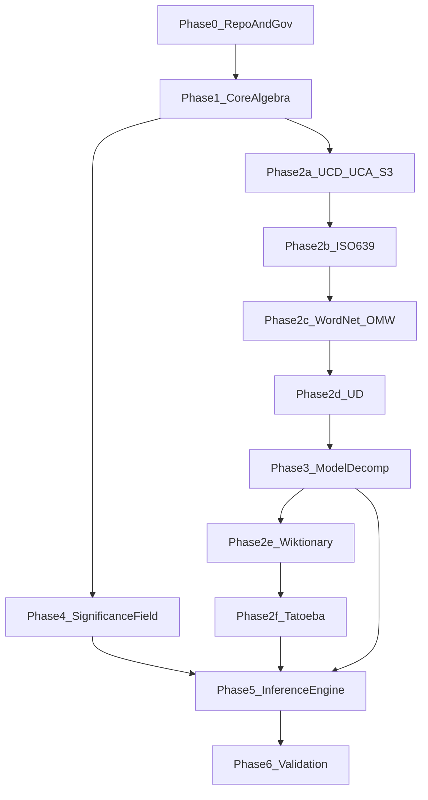

# Hartonomous: Universal Substrate Architecture

This document is the authoritative architecture reference. Individual decomposer specs live in `specs/decomposers/`. Engine specs live in `specs/engine/`. Modality specs live in `specs/modalities/`.

## What This Is

A PostgreSQL database that IS an AI model. Not a database backing an AI. The database itself.

- **Engine**: PostgreSQL + PostGIS. Connection string from CLI arguments, `HARTONOMOUS_DB` environment variable, or the compiled default (`localhost:5433`, user `hartonomous`). See `docs/standards/configuration-and-errors.md` for the full precedence chain.
- **Architecture**: centralized stored procedures, functions, views, custom types, domains. SQL orchestrates all operations. Extensions handle compute-intensive work. Client handles presentation.
- **Training** = `INSERT/UPDATE` with typed semantic edge extraction at ingestion time.
- **Pruning** = `DELETE` with policy governance.
- **Distillation** = `WHERE` clause + type/modality/trust constraints.
- **Inference** = controlled recursive traversal of decomposed semantic edges, composed into output.
- **Context** = infinite (prompts are content, all content is addressable substrate state).
- **Export** = per-modality recomposers reconstruct original formats from substrate. The substrate IS the storage after decomposition.

No conventional training loops. No GPU dependency. No fixed context windows. No loss. No error swallowing.

## What This Replaces

This is not an incremental improvement to existing AI. It is a different computational model for intelligence. Every section below describes a paradigm that the entire AI industry treats as fundamental, and how this architecture eliminates it.

### The Forward Pass Is Gone

Every AI system in the world — GPT, Claude, Gemini, Llama, Qwen, DeepSeek, every model from every lab — performs O(N² × d) matrix multiplication on every query. Self-attention multiplies query, key, and value matrices across all tokens. Feed-forward layers multiply again. Layer normalization, residual connections, softmax — billions of floating-point operations, every single time someone asks a question. The entire GPU industrial complex — NVIDIA's valuation, the data center arms race, the energy crisis from AI compute — exists because of this operation.

Hartonomous does not perform it. At all. Inference is A\* traversal over pre-indexed, significance-rated, typed semantic edges. O(K × B × log N) where K is bounded by cost budget, B is bounded by type+significance pruning, and log N is B-tree depth (~30 for a billion entities). The database does what databases do — indexed lookups — and the answer emerges from traversal, not computation. No matrix multiplication. No attention mechanism. No forward pass. No GPU required.

### Training as a Paradigm Is Ended

Conventional AI training is stochastic gradient descent: initialize random weights, run data through the network, compute loss, backpropagate gradients, nudge weights, repeat for billions of iterations. It requires distributed GPU clusters, months of wall-clock time, millions of dollars per training run, and produces an opaque artifact (a weight file) that no one can inspect, audit, or understand. Hyperparameter search is trial and error. Convergence is hoped for, not guaranteed. Catastrophic forgetting destroys previously learned knowledge when new knowledge is added.

Hartonomous replaces all of this with deterministic ingestion. Knowledge enters the substrate via decomposition: structured parsing → entity creation → edge extraction → significance initialization from trust priors. Every entity is hashed, deduplicated, and indexed at INSERT time. Every edge is typed, FK-constrained, and significance-rated. No gradient descent. No loss function. No backpropagation. No hyperparameter search. No catastrophic forgetting — new knowledge adds entities and edges without disturbing existing ones. Knowledge quality is determined by arena competition against structural ground truth, not by loss curve convergence.

### Hallucination Is Solved

Not mitigated. Not guardrailed. Not reduced. Eliminated structurally.

Every AI company in the world is spending billions trying to suppress hallucination — RLHF, constitutional AI, chain-of-thought verification, retrieval augmentation, guardrails, confidence calibration. All of these are patches on a fundamental problem: the transformer generates output by sampling from probability distributions over tokens. There is no mechanism to distinguish "probable" from "true." The model assigns probability to tokens based on co-occurrence statistics in training data — a confident hallucination and a correct answer look identical from inside the network.

In the substrate, every relationship is a typed edge with a Glicko-2 significance rating earned through arena competition against authoritative ground truth — Unicode character identity (UCD), universal grammar (UD), semantic ontology (WordNet), cross-lingual alignment (OMW). A hallucinated relationship is an edge whose significance drops to near-zero because it cannot survive competition against structural truth. It doesn't reach inference threshold. The mechanism that produces hallucination in transformers — unconstrained probabilistic generation — does not exist here. Inference traverses edges that exist and have survived competition. If the edge doesn't exist or its significance is below threshold, the system says nothing rather than inventing something.

### Context Is Infinite

Not 128K tokens. Not 1M tokens. Not "extended" or "expanded." Infinite.

The attention matrix is the fundamental bottleneck of transformer architecture. It is O(N²) in sequence length. Every "context window expansion" is an engineering hack to make that quadratic cost slightly more bearable — sliding windows, sparse attention, linear attention approximations. All of them trade fidelity for length.

In the substrate, there is no attention matrix. Prompts are content. Every prompt ever submitted is decomposed into permanent substrate state — entities and edges scoped by (tenant_id, user_id) via provenance. Previous conversations are not "recalled" or "retrieved" — they are part of the graph, always addressable, always traversable. A user's first conversation and their ten-thousandth conversation are equidistant from inference — both are entities with significance-rated edges that the traversal can reach. There is no window to overflow because there is no window.

### The Black Box Is a Crystal Ball

"Explainable AI" in the conventional paradigm means training a second model to guess why the first model did what it did. Post-hoc rationalization of opaque matrix operations. The "explanation" is itself a statistical approximation with no guarantee of accuracy.

In the substrate, inference is traversal. The path IS the explanation. Every edge traversed, every significance rating consulted, every branch taken and every branch pruned — visible, auditable, reproducible. "Why did the system say X?" is answered by showing the traversal path: which entities were activated, which edges were followed, what their significance ratings were, what arena competition produced those ratings, what seed sources contributed the authoritative edges. The provenance chain from answer back to ground truth is a concrete, queryable graph path — not a guess.

### All Modalities Are One Representation

Conventional multi-modal AI stitches separate encoders together with projection layers. A vision encoder, a text encoder, a speech encoder, each producing embeddings in different spaces, connected by learned linear projections that map one embedding space to another. The projection is a trained approximation. Cross-modal understanding is as good as the projection, which is as good as the training data for that specific modality pair.

In the substrate, text, image, audio, video, and model weights are the same thing: entities with typed edges and geometric physicality stored in one `physicality` table. That table has two coordinate surfaces, both first-class and both GiST-indexed. Modalities whose physicality is natively 2D or 3D — pixel grids, audio sample grids, video-frame time, terrestrial S² — use PostGIS `geometry` (POINT, POINTZ, LINESTRING, LINESTRINGZ, MULTILINESTRINGZ) where 2D and 3D operators are exact. Physicality that is genuinely 4D — codepoint atoms on S³ from UCA Super-Fibonacci projection, embedding fireflies in R⁴ from Laplacian eigenmaps, edge trajectories through 4D participants, compositional trajectories through 4D children — uses the substrate-native `point4d` / `box4d` / `linestring4d` type surface defined in `specs/native/4d-type-and-index.md`, with its own operators (`<->` Euclidean 4D, `<=>` S³ geodesic), its own GiST and SP-GiST opclasses, its own aggregates (`centroid_4d`, `centroid_s3`, `bbox_4d`), its own Fréchet and Hausdorff in four dimensions. PostGIS cannot be used for 4D storage — its distance operators and GiST keys drop the M axis silently. The two surfaces coexist in one table via two coordinate columns (one PostGIS `geometry`, one substrate `point4d`/`linestring4d`); exactly one is non-null per row, selected by the physicality type's declared dimensionality. Shape comparisons across two trajectories — word similarity, audio waveform similarity, attention pattern similarity, image contour similarity — use the appropriate surface's distance primitive for the dimensionality involved. Cross-modal edges are first-class edges with significance ratings, not projection-layer approximations. "This audio segment sounds like this word" is an edge, not an embedding distance.

### AI Is Democratized

Today, the ability to run state-of-the-art AI is concentrated in organizations that can afford massive GPU infrastructure. OpenAI, Google, Anthropic, Meta — they have the hardware, so they have the capability. Everyone else rents access via API.

Hartonomous runs on PostgreSQL on commodity hardware. A developer with a laptop and a PostgreSQL installation has the full substrate: infinite context, no hallucination, transparent inference, all modalities, significance-rated knowledge from every open-source model and authoritative dataset. The power differential between a trillion-dollar AI lab and a single developer narrows to the substrate's ingested data — and that data is built from open sources (Unicode, WordNet, Universal Dependencies, open-weight models). The GPU requirement was never a law of physics. It was a consequence of the forward pass. Remove the forward pass, remove the GPU requirement, remove the concentration of power.

### Ingest Any Model, Export a Denser One

You can ingest any safetensors model into the substrate and immediately export it back out as a superior version. No retraining. No finetuning. No GPU-hours. No one else in the world can do this.

A conventional model carries billions of parameters, most of which are gradient noise — the microscopic weight fluctuations that gradient descent requires to converge but that encode no semantic information. Near-zero singular values. Redundant encodings of the same pattern across dozens of attention heads. Hallucinated relationships that survived training because no mechanism existed to challenge them. All dead weight dragged through every forward pass.

The substrate discards all of it at ingestion. SVD strips gradient jitter; near-zero singular values never enter the substrate. Content-addressable hashing stores each pattern once regardless of how many heads encoded it with slightly different noise profiles. Arena competition against authoritative seeds drops the significance of hallucinated relationships below export threshold. The exported model encodes the same knowledge in fewer parameters with no noise floor. This is what deduplication, sparsity, and significance rating do to any content — models just benefit dramatically because they carry so much dead weight.

## The Knowledge Demon

Laplace's Demon is a thought experiment: an intellect that knows the precise position and momentum of every particle in the universe could derive any past state and predict any future state. It is impossible for physical matter because you cannot capture every particle.

Hartonomous is the knowledge equivalent. Not for particles — for semantics. Every Unicode codepoint. Every syntactic structure across 100+ languages. Every word sense and cross-lingual alignment. Every morphological form and inflection. Every attention pattern and semantic relation extracted from every ingested model. Ingested deterministically, stored losslessly, traversed mechanically.

The transformer *predicts*. It assigns probability to the next token based on statistical patterns in training data. It does not know — it guesses, confidently. The substrate *knows*. It traverses edges that exist, with significance ratings earned through competition against ground truth. The answer is not sampled from a distribution — it is extracted from a structure. The distinction is not rhetorical. A prediction can be wrong in ways that are undetectable from inside the system. A traversal either reaches a destination or it doesn't — and the path it took is the proof.

This is the familiar. Not a tool you query. Not a service you rent. A system that runs on your hardware, contains the knowledge, shows its work, never forgets, never hallucinates, and gets denser every time you feed it another model. The knowledge version of Laplace's Demon, domesticated.

## What This Is NOT

To prevent pattern-matching to existing paradigms:

- **This is not RAG** (Retrieval-Augmented Generation). RAG retrieves text chunks and stuffs them into a transformer's context window, which then does a forward pass to generate output. Hartonomous has no forward pass. There is no "generation model" that retrieved context gets fed into. Inference IS the retrieval — traversal over significance-rated edges. There is no separate retrieval step and generation step. They are the same operation.

- **This is not a knowledge graph with an LLM on top.** Knowledge graphs (Neo4j, Amazon Neptune, etc.) store triples (subject-predicate-object) and answer queries via graph traversal, but they do not perform inference, generate natural language, translate between languages, or handle images/audio/video. When people bolt an LLM onto a knowledge graph, the LLM is still doing the forward pass. Hartonomous IS the inference engine — traversal produces the answer, and recomposers format it into the output modality.

- **This is not a vector database.** pgvector, Pinecone, Weaviate, Milvus — these store embedding vectors and perform approximate nearest-neighbor search. Hartonomous does not use embeddings. It does not use ANN. Distance between entities is Glicko-2 significance on typed edges and Fréchet/Hausdorff distance on S3 geometric coordinates. The spatial operations are exact, not approximate.

- **This is not semantic search.** Semantic search encodes queries and documents into a shared embedding space and finds similar documents by vector distance. Hartonomous does not encode anything into vectors. It decomposes content into structural entities with typed edges and traverses the graph. The result is not "similar documents" — it is a mechanically derived answer with a concrete provenance chain.

- **This is not prompt engineering.** There is no "prompt" in the transformer sense — no token sequence fed into an attention mechanism. A user's input is decomposed into substrate entities like any other content. The entities activated by the input become seeds for traversal. The traversal finds the answer. There is no trick to phrasing the input correctly because there is no statistical model being steered.

- **This is not fine-tuning.** Fine-tuning adjusts model weights via gradient descent on a smaller dataset. Hartonomous does not have weights to adjust. New knowledge enters via ingestion — INSERT statements that create entities and edges. The substrate grows monotonically. Nothing is overwritten. Nothing is forgotten.

## Future Direction — Decentralized Mode

A planned mode (not scheduled, not on the M1–M11 critical path) splits the substrate across participating user hardware in exchange for usage credits. This is a deliberate forward direction, not a hypothetical. Content-addressing via BLAKE3 Merkle DAG is already decentralization-friendly by construction — identity is derivable from content alone, independent of which host stores which partition. Glicko-2 significance state is per-entity and per-edge, carryable across hosts without reconciliation drift. The current single-process implementation must not paint corners that would later have to be torn up (centralized-only assumptions in identity generation, threading backend choices that preclude distributed coordination, migration formats that assume a single authority). Distributed-compute tooling — MPI, shared-memory coordination libraries, gossip protocols, federated sync, sharded content-addressed stores — is **deferred for decentralized mode**, not out of scope. Do not scaffold decentralization into M1–M11 code; do keep the door open.

## Cost Model

**Expensive ingestion, cheap queries.** This is the fundamental inversion from conventional AI.

Conventional transformers pay compute cost *per query* — every forward pass re-multiplies weight matrices, runs attention across tokens, and samples from probability distributions. Hartonomous pays compute cost *per ingestion* — SVD on weight matrices, FFT on audio, edge detection on images, morphological analysis on text, Glicko-2 initial ratings from trust priors — all run at INSERT time. Results are stored as pre-computed edges with significance scores, fully indexed.

At query time, every question the inference engine answers is a series of indexed lookups over pre-computed results. No matrix multiplication. No forward pass. No sampling. Just traversal of edges that already exist with ratings that already exist.

## What "No ANN" Means

The system does not use HNSW indexes, pgvector, cosine similarity over embedding vectors, or KNN/ANN approximate nearest-neighbor search as the retrieval mechanism. These are replaced by:

- **Glicko-2 rated significance** on typed semantic edges — the "distance" between two entities is the significance score on the edge connecting them (or the product of edge significances along the path between them).
- **Referential integrity** — FK-constrained graph walks over B-tree/GiST indexed relational columns.
- **Fréchet and Hausdorff distance on stored trajectories** — for spatial similarity queries across any modality. 2D/3D trajectories (image contours, audio waveforms) use PostGIS `ST_FrechetDistance` / `ST_HausdorffDistance`. 4D trajectories (edge trajectories through S³ or R⁴ participants, compositional trajectories through 4D children, codepoint-path trajectories through unit-quaternion positions) use the substrate-native 4D Fréchet/Hausdorff primitives over `linestring4d` defined in `specs/native/4d-type-and-index.md`. Both are real geometric distances, not vector dot products.

Classical algorithms (FFT, SVD, edge detection, spectral analysis) are used freely at ingestion time. Knowledge extracted from neural network weights (via the Safetensors decomposer) becomes explicit typed edges in the substrate. The system *uses* neural network knowledge — it extracts it once at ingestion and never runs inference through the network again.

## Substrate Laws

1. **Identity**: same content = same hash, every level. Duplication is a defect.
2. **Structural sharing**: store once, reference many. Cascades upward through Merkle tree.
3. **Cascade compression**: RLE/sparse/dedupe recursive at every level, intrinsic to references.
4. **Integrity**: all semantics are typed edges with FK/domain/range constraints. Referential integrity IS the performance engine.
5. **Export**: applies to **modalities** (text, image, audio, video) and **AI models** — not to seed sources. Seed datasets (WordNet, UD, UCD, ISO 639, Wiktionary, Tatoeba) are ingested once to build the substrate's knowledge graph; they are not re-exported. For modalities: recomposers reconstruct original artifact formats from substrate state. The substrate is NOT a storage mechanism — it is an AI model that can export its training data. Every format (JPEG, MP3, PNG, WAV, etc.) is structurally decomposed into entities: format headers, metadata sections, quantization tables, DCT coefficients, frame parameters, PCM samples — all typed entities in the Merkle DAG. No binary blobs. No "original bytes on the side." Round-trip means the recomposer walks the structural entity tree and reconstructs a valid file. Bit-perfect for lossless formats. For lossy formats, structurally faithful — the reconstructed file is semantically identical because every structural component was preserved as an entity. For AI models: export is **distillation**. The substrate is the teacher. A `SELECT ... WHERE ...` query defines the scope of knowledge. The `SafetensorsRecomposer` builds a new student model from the query results — fresh weight matrices synthesized from substrate significance scores and edges. Near-zero and below-threshold weights are zeros. The export is not the original model reconstructed; it is a new model that encodes the substrate's accumulated knowledge.
6. **Decomposition determinism**: same input + same decomposer version = same substrate state. No randomness, no approximation at ingestion time. Inference is deliberately non-deterministic — significance scores evolve from arena updates, so the same query at different times may traverse different paths as the substrate learns. Provenance on every entity enables temporal replay — "what would inference have returned at timestamp T?" is answerable by filtering to significance state as of T.
7. **Language agnosticism**: text segmentation (codepoints → grapheme clusters → words → sentences) from Unicode properties (UCD/UCA), not language heuristics. UAX #29 algorithms. No language-specific tokenizers.
8. **Ingestion records facts, inference decides meaning**: decomposition records ALL candidate senses, syntactic structures, and evidence edges without disambiguation. Sense selection, role assignment, and meaning resolution happen at inference time via significance-weighted traversal. Decomposers never guess.
9. **Context**: prompts are content. Context is graph-addressable substrate state. No token window. No attention matrix. Previous turns are session-scoped entities with significance scores. Relevant context is selected by the same traversal mechanism as all other inference.
10. **Runtime**: CPU/index/pathing first. GPU/ANN are optional accelerators, never requirements.
   - **Positioning commitment.** The invention is explicitly designed to *prove GPU is not required* for a substrate-native AI at real scale. The ingestion stack commits to the full Intel CPU optimization surface — MKL (ILP64 under `MKL_CBWR=AUTO,STRICT` for bitwise reduction order), TBB as the MKL threading layer, TCM (`tbbmalloc`) as the scalable allocator, IPP where applicable, oneDPL header-only parallel STL, and oneDNN gated behind `HTNS_ENABLE_ONEDNN` for JIT attention kernels in analysis passes. Intel `icx` is the preferred compiler; MSVC is the Windows fallback. No CUDA, no ROCm, no GPU BLAS, no GPU-assumption code paths anywhere. If a conventional approach assumes GPU, the substrate takes the CPU route. See `specs/native/compute-library.md` for the two-artifact split (ILP64 ingest vs LP64 query) and the ISA ceiling (AVX2+FMA3+AVX-VNNI+BMI2 — no AVX-512 on the reference 14900KS).
11. **Sparsity**: near-zero-significance edges are not stored. Policy-governed, auditable.
12. **Semantic fidelity**: no flattening. No lazy n-ary grouping without proper semantic extraction. Every composition must carry correct edges. Fail explicitly if unable.
13. **Fail loud**: no error swallowing. No silent failures. No fallback continuations. No graceful degradation. No partial results. Every operation succeeds completely or fails explicitly with full diagnostic context. The only retry-eligible errors are transient infrastructure failures (database connection timeout, deadlock); these retry at the pipeline level with bounded attempts, not inside individual operations. A failure during seed ingestion means the substrate's initial state is broken. A failure in significance computation means ELO ratings are muddied. A failure anywhere means everything downstream is wrong. The only acceptable response to failure is: stop, report exactly what broke and why, fix it, then re-run from the last known-good state. If storage fills up, that is a defect in capacity planning — halt, do not attempt to continue. If source data is missing, that is a defect in deployment — halt, do not attempt to continue.

## Core Algebra

### Entity Unification

The entity table holds **atoms** and **compositions**. One table. Two roles. The `entity_type_id` tells you what structural kind an entity is. The tier is emergent from reference depth.

- **Atom**: a leaf-level entity with no children. A Unicode codepoint (tier 0). Atoms are positioned on the S³ surface as unit quaternions stored as `point4d` — the atom's four-coordinate S³ position IS its centroid.
- **Composition**: an entity whose content is an ordered sequence of child entities. A word like [m,i,n,u,t,e] is a composition of codepoint atoms. A sentence is a composition of word compositions. An image region is a composition of pixel value compositions. An FFT spectrum is a composition of frequency-magnitude points. Same content = same hash = one entity, always.

Relations between entities live in the **edge** table — a separate, n-ary structure with its own trajectory geometry. Edges are typed, evidence-based, and carry significance. Edges are NOT entities. They are the connective tissue of the substrate — the AI model IS its edges.

Classification vocabulary — POS types, dependency relation types, morphological features, sense categories, Unicode property values, tensor role types — lives in **reference tables**. These are properly normalized lookup tables populated during seed ingestion. They are NOT entities in the entity table. They enable fast indexed lookups: "Is 'rake' a noun?" is a JOIN against a junction table, not a graph traversal.

**Tier** is emergent from reference depth, not hardcoded. Tier 0 = atoms (codepoints). Tier N = compositions over tier-(N-1) entities. Higher-tier entities have physicality centroids that drift toward the interior of the S3 — the more constituents averaged, the closer to center.

### Recursive Physicality

Every entity has a geometric position. Physicality is ONE normalized table for all modalities — text, image, audio, video, model weights, analysis results. One table. Two coordinate surfaces within it: PostGIS `geometry` for natively 2D/3D physicality, substrate-native `point4d` / `linestring4d` for 4D. Each physicality type declares which surface it lives on; exactly one coordinate column is non-null per row. Both surfaces are GiST-indexed.

- **Tier-0 atom (4D surface)**: `point4d` on S³ (from UCA Super-Fibonacci projection — a unit quaternion). The atom's four-coordinate position IS its centroid. Indexed by `point4d_gist_ops`.
- **Tier-N composition (4D surface)**: `linestring4d` through the four-coordinate positions of its constituent entities in sequence order. `[c,a,t]` is a linestring through the S³ positions of `c`, `a`, and `t`. The 4D centroid of that linestring (via `centroid_4d` for Euclidean, `centroid_s3` for direction-only) IS the word's 4D position.
- **Next level up**: that 4D centroid becomes a point in the parent composition's `linestring4d`. `[the, cat, in, the, hat]` is a linestring through the centroids of those five word entities. Recursive. No special cases.
- **2D/3D analysis results**: FFT spectrum = LINESTRINGZ (X=frequency bin, Y=magnitude, Z=phase) with magnitude on Z. STFT spectrogram = MULTILINESTRINGZ (each linestring = one time window's FFT). Pixel patches = POINT/POLYGON on 2D image coordinates. These stay on the PostGIS `geometry` surface where 2D/3D operators and GiST keys are exact.
- **4D analysis results**: anything whose native geometry is genuinely 4D — SVD singular-value spectra paired with subspace angles, attention-pattern trajectories across S³, tensor operator characteristic curves in R⁴ — lives on the `point4d`/`linestring4d` surface so all four axes participate in every distance, range, and centroid query.

Both surfaces expose a compatible shape-comparison vocabulary — Fréchet, Hausdorff, centroid, containment, kNN, Hilbert-ordered scans — in their own dimensionality. One row, one geometry value, one GiST index entry, in whichever surface the physicality type belongs to.

`ST_FrechetDistance` (2D/3D) and the 4D Fréchet primitive (substrate-native over `linestring4d`) compare the SHAPE of any two trajectories in their respective surfaces: word similarity (king vs sing vs ring share `[i,n,g]` suffix trajectory across 4D codepoint positions), syntactic tree similarity (two sentences with the same dependency structure), audio similarity (two 2D/3D waveforms), attention pattern similarity (two 4D attention trajectories). The operator is determined by the physicality type of the rows being compared, not by modality label.

This is the Merkle DAG. Each level's geometry is deterministically derived from the level below. Same content = same hash = same geometry = same entity.

### 4D Coordinate Semantics

`point4d` carries four `float8` coordinates (`x1, x2, x3, x4`) that are application-defined per physicality type. For a codepoint atom on S³ they are the four components of a unit quaternion. For an embedding firefly they are `(eig2, eig3, eig4, ||row||)` — three orthonormalized Laplacian-eigenmap axes plus the row's pre-normalization L2 norm. For a different 4D physicality type they may encode something else entirely; semantics are carried by `physicality_type_id`, not by the type itself. All four coordinates participate in every distance, kNN, centroid, and box containment query — that is the whole point of the surface.

A composition's `linestring4d` carries one 4-tuple per child entity in sequence order. The encoding choice is carried by the physicality type: it may be the child's 4D centroid (direct shape encoding, enables Fréchet/Hausdorff across compositional shape), the child's S³ position combined with a sequence payload (enables shape comparison plus direct child readback), or a compact self-describing layout where one axis carries a surrogate reference and the other three carry the child's S³ direction. Whichever encoding the type declares, recomposition reads the linestring directly — the geometry IS the composition, no JOIN to `sequence` is required when the physicality type embeds child references. The `sequence` table remains the integrity enforcement layer; `physicality` remains the traversal-and-comparison layer.

The 2D/3D side (`geometry` column) keeps PostGIS's XYZ semantics unchanged for physicality types whose dimensionality is 2 or 3.

### Two Distinct Geometric Mechanisms

The substrate has two separate and non-interchangeable geometric operations. Conflating them produces nonsense.

**1. Compositional geometry** — the trajectory (2D/3D `LINESTRING*` or 4D `linestring4d`, chosen by the composition's physicality type) of an entity's constituent sequence. `[k,i,n,g]` is a path through four codepoint S³ positions, stored as `linestring4d`. This captures structural and orthographic similarity. `king`, `ring`, `sing`, `ding` share the `[i,n,g]` suffix trajectory — 4D Fréchet detects that shared path. This is the geometry of WHAT SOMETHING IS MADE OF.

**2. Relational geometry** — the `edge.geom_4d` (or `edge.geom` for 2D/3D participants) of each edge in the substrate. Every edge (hypernym, nsubj, translation_of, gender_correspondence, etc.) is a trajectory through its n-ary participants' positions, in the surface dictated by the participants' physicality. For edges whose participants live on S³ / in R⁴, the edge carries a `linestring4d`; for edges whose participants live on the 2D/3D surface, the edge carries a PostGIS `LINESTRING*`. This captures the shape of a RELATIONSHIP between entities. This is the geometry of HOW ENTITIES CONNECT TO EACH OTHER.

These are not two ways of looking at the same thing. A word like "finance" has one compositional trajectory (the path through `[f,i,n,a,n,c,e]` in 4D) and thousands of relational trajectories — one for every edge it participates in. Fréchet on compositional trajectories finds orthographically similar words. Fréchet on relational trajectories finds structurally similar relationships. Either flavour runs on the appropriate 2D/3D or 4D primitives; the substrate never conflates dimensionality.

The significance-weighted edge graph — the spider colony — is a third mechanism entirely: not geometry, but propagation. When inference activates an entity, significance ratings on every connected edge determine how hard each strand tugs. High Glicko-2 mu = strong pull. Low mu = barely moves. Because entities are Merkle-deduplicated and shared across the entire substrate, pulling one strand tugs every composition, every synset, every model-derived edge, every co-occurrence that shares that entity — and each of those tugs propagates through their own edges. The tension is inference. The mu values are the spring constants. This is the geometry of HOW MEANING PROPAGATES.

### Relational Geometry: Edge Trajectories as Relation Fingerprints

Every edge has a stored trajectory, in whichever surface its participants occupy. For 4D participants, that is a `linestring4d` through the participants' `point4d` positions in role order. For 2D/3D participants, that is a PostGIS `LINESTRING*`. This trajectory is the structural fingerprint of that specific relationship.

The edge between `king` and `queen` traces a path across S³ (both codepoint-compositions are 4D entities, so the edge carries a `linestring4d`). The edge between `man` and `woman` traces a path. The edge between `actor` and `actress` traces a path. These are all `gender_correspondence` edges — and their 4D trajectories are geometrically similar. The 4D Fréchet distance between them is small. The relation type has a characteristic spatial signature in S³.

This is not an analysis pass run separately. The edge's trajectory column is first-class, GiST-indexed (PostGIS GiST for 2D/3D, `point4d_gist_ops` / `linestring4d_gist_ops` for 4D), populated at ingestion. Every stored edge IS its trajectory. Comparing any two edges is a single Fréchet call on their stored geometries in the matching surface.

The relational geometry enables:
- **Analogy completion**: find edges whose trajectory best matches a query trajectory. `king:queen :: man:?` is a Fréchet query, not a vector arithmetic operation. The substrate finds the edge that completes the geometric pattern.
- **Relation clustering**: group edge types by the distribution of their trajectory shapes. Semantic relations cluster separately from syntactic relations cluster separately from cross-lingual alignment edges — the geometry reflects the underlying structure.
- **Relation transfer**: a newly ingested entity with edges to existing nodes inherits relation patterns — its edge geometries place it in the same relation clusters as structurally similar entities, without any training.

### Frayed Edge Detection: The Periodic Table of Knowledge

Each edge type — hypernym, gender_correspondence, translation_of, nsubj — has a characteristic Fréchet distribution across all its instances. This distribution defines what that relation looks like spatially. The tightly documented region of any relation type is the well-woven part of the fabric.

At the boundary of documented knowledge, the fabric frays. Entity pairs exist whose S3 positions place them exactly where a relation edge should be — within the Fréchet threshold of the known distribution for that edge type — but no edge has ever been recorded between them. The geometry says the thread should be there. The substrate confirms it is absent. That absence is a frayed edge: not a random gap, a structurally predicted one.

This is queryable directly:

```sql
-- Find entity pairs whose S3 positions match the hypernym edge distribution
-- but which have no hypernym edge between them
-- (gap prediction: predicted-missing hypernym relations)
```

The substrate does not require this query to be run manually. The frayed edges are implicit in the geometry at all times. Any inference traversal that reaches an entity cluster can detect the local fraying — the places where the significance-weighted graph has no entry but the geometric structure implies one should exist.

This is the knowledge equivalent of Mendeleev's periodic table. Mendeleev arranged elements by observable properties — atomic weight, valence — and the periodicity of the pattern revealed gaps: positions in the table that had to be occupied by elements not yet discovered. He predicted their properties from the geometry of the pattern around the gap. He was right.

The substrate does the same for all knowledge. Relations cluster by trajectory shape. Gaps in the clustering are predictions — entity pairs the structure says should be connected, by a specific relation type, with derivable properties — but that haven't been documented yet. Every new corpus ingested fills some frayed edges and reveals new ones at the expanded frontier.

The substrate doesn't just store what is known. The geometry of what is known implies what isn't. The frayed edges are the research agenda.

### Hash Function: BLAKE3 SIMD

One centralized, canonical hash implementation. **BLAKE3** with SIMD acceleration.

- **Atom**: hash of the canonical content value (e.g., the codepoint integer value).
- **Composition**: hash of the ordered concatenation of child entity hashes (Merkle tree — a composition's identity is fully determined by its children and their order).
- **Edge**: hash of `(edge_type_id, participant_hashes_in_role_order)` — the edge type and its participants determine identity. N-ary edges hash all participants.

Same content = same hash = same entity = no duplicate storage. [m,i,n,u,t,e] hashes identically regardless of where or when it was ingested. "minute" the word is ONE entity — the senses (small vs 60-seconds) are different edges connecting to different sense reference entries.

Hash collisions are astronomically unlikely with BLAKE3's 256-bit output. Collision handling is not needed — a collision would be a defect in BLAKE3 itself.

The hash lives on the `entity` table as the identity/deduplication mechanism. It is NOT the same as the S3 geometric position on the `physicality` table.

### Schema

#### Entity (One Table. Atoms and Compositions.)

| Column | Type | Purpose |
|--------|------|---------|
| `id` | `BIGSERIAL` | Primary key. Internal identity. |
| `hash` | `BYTEA(32)` | BLAKE3 content hash. `UNIQUE` constraint. Same content = same hash = same entity. |
| `entity_type_id` | `INT FK → entity_type(id)` | Structural classification — what kind of content this is. |

The entity table does NOT self-reference for types. Entity types are a reference table (see below).

#### Entity Type (Reference Table)

| Column | Type | Purpose |
|--------|------|---------|
| `id` | `SERIAL` | Primary key. |
| `code` | `VARCHAR UNIQUE` | Structural type code: `codepoint`, `grapheme_cluster`, `word_form`, `morpheme`, `lemma`, `ud_sentence`, `ud_token`, `tatoeba_sentence`, `text_composition`, `paragraph`, `document`, `pixel_region`, `audio_recording`, `audio_chunk`, `video_frame`, `tensor`, `model_architecture`, `attention_pattern`, `bpe_token`, `synset`, `word_sense`, `wikt_sense`, `inflected_form`, `collation_element`, `language_name`, etc. |
| `modality` | `VARCHAR` | Which modality: `text`, `image`, `audio`, `video`, `model`, `universal`. |

Small table. Populated during Phase 1 (core algebra). Rarely changed after.

#### Physicality (Universal Geometry — One Table, All Modalities)

| Column | Type | Purpose |
|--------|------|---------|
| `id` | `BIGSERIAL` | Primary key. |
| `entity_id` | `BIGINT FK → entity(id)` | Which entity. |
| `physicality_type_id` | `INT FK → physicality_type(id)` | What this geometry represents. Also declares which coordinate surface this row uses. |
| `geom` | `GEOMETRY` (nullable) | PostGIS 2D/3D surface. POINT / POINTZ / LINESTRING / LINESTRINGZ / MULTILINESTRINGZ. GiST-indexed. Non-null iff `physicality_type.dimensionality ∈ {2, 3}`. |
| `point4d` | `point4d` (nullable) | Substrate-native 4D point surface. Non-null iff `physicality_type.dimensionality = 4` and the type stores a single 4D position. GiST-indexed via `point4d_gist_ops` (also SP-GiST via `point4d_spgist_ops`). |
| `linestring4d` | `linestring4d` (nullable) | Substrate-native 4D trajectory surface. Non-null iff `physicality_type.dimensionality = 4` and the type stores a trajectory (composition, edge trajectory, attention path, etc.). GiST-indexed. |

One table for everything. A CHECK constraint enforces exactly one of `geom`, `point4d`, `linestring4d` non-null per row, selected by `physicality_type_id → ref_physicality_type.dimensionality` and the type's declared coordinate shape (`point` vs `trajectory`). Query the physicality table for any spatial operation across any modality; the operator you apply must match the surface for that row's type.

Rows using the 4D surface (codepoint S³ positions, compositional trajectories through S³, edge trajectories through S³ / R⁴, embedding fireflies in R⁴):
- Tier-0 codepoint: `point4d` on S³ (UCA Super-Fibonacci projection — a unit quaternion). Centroid = same point.
- Word [c,a,t]: `linestring4d` through the S³ positions of c, a, t. 4D centroid of this linestring (`centroid_4d` or `centroid_s3`) = word's own 4D position.
- Sentence: `linestring4d` through word 4D centroids. Centroid = sentence's 4D position.
- Embedding firefly: `point4d(eig2, eig3, eig4, ||row||)` from Laplacian eigenmap + Gram-Schmidt.
- Attention-pattern trajectory: `linestring4d` across S³ attention head positions.
- SVD singular-value spectra paired with subspace angles, any tensor-operator characteristic curve that is natively 4D: `linestring4d`.

Rows using the 2D/3D PostGIS surface (modalities whose physicality is natively 2D or 3D):
- Audio waveform: LINESTRINGZ (X=time, Y=amplitude, Z=frequency band).
- FFT spectrum: LINESTRINGZ (X=frequency bin, Y=magnitude, Z=phase).
- STFT spectrogram: MULTILINESTRINGZ — each linestring is one time window's FFT. Whole spectrogram = one geometry, one row, one GiST entry.
- Image contour: LINESTRING / LINESTRINGZ in pixel space. Shape similarity = PostGIS `ST_FrechetDistance`.
- Pitch contour: LINESTRINGZ (X=time, Y=Hz, Z=confidence). Prosodic comparison = PostGIS `ST_FrechetDistance`.

One entity can have multiple physicality rows (different `physicality_type_id`s and different surfaces) — e.g., a word may have a 4D S³ trajectory AND a Hilbert curve value AND a 2D pixel bounding box if rendered.

Operators for the 2D/3D surface (PostGIS, work universally because geometry types are coordinate containers, not geographic data structures):
- `ST_FrechetDistance(a, b)` — shape similarity between any two 2D/3D trajectories.
- `ST_HausdorffDistance(a, b)` — set-based shape distance.
- `ST_DWithin(a, b, d)`, `ST_LineSubstring`, `ST_Simplify`, `ST_NPoints`, `ST_Centroid` — standard PostGIS.

Operators for the 4D surface (substrate-native, defined in `specs/native/4d-type-and-index.md`):
- `<->` (Euclidean 4D distance), `<=>` (S³ geodesic = `acos(clamp(⟨a,b⟩, −1, 1))`).
- `&&`, `@>`, `<@`, `=` (box overlap / containment / equality) on `box4d`.
- `centroid_4d(point4d)`, `centroid_s3(point4d)` (direction-only with unit-norm re-projection), `bbox_4d(point4d)` aggregates.
- `distance_4d`, `distance_s3`, `dot_4d`, `norm_4d`, `normalize_4d`, `slerp`, `antipode`, `super_fibonacci_4d`, `hilbert_4d` / `hilbert_4d_inverse` scalars.
- Fréchet and Hausdorff primitives over `linestring4d` (substrate-native 4D shape comparison).

The two surfaces never mix in a single operator call — you never pass a `point4d` to `ST_FrechetDistance` or a `LINESTRINGZ` to `distance_s3`. The physicality type's declared dimensionality tells callers which surface to query against.

Custom C/C++ extension functions extend spatial operators for S3-specific distance metrics beyond what PostGIS provides natively.

#### Physicality Type (Reference Table)

| Column | Type | Purpose |
|--------|------|---------|
| `id` | `SERIAL` | Primary key. |
| `code` | `VARCHAR UNIQUE` | `s3_position`, `waveform`, `fft_spectrum`, `stft_spectrogram`, `pitch_contour`, `formant_trajectory`, `spectral_centroid`, `svd_spectrum`, `weight_distribution`, `contour`, `hilbert_value`, `mfcc_frame`, `chromagram`, etc. |

#### Sequence (Merkle DAG Structure)

| Column | Type | Purpose |
|--------|------|---------|
| `parent_id` | `BIGINT FK → entity(id)` | The composition entity. |
| `child_id` | `BIGINT FK → entity(id)` | A constituent entity. |
| `position` | `INTEGER` | Ordinal position within the parent (0-indexed). |
| `count` | `INTEGER DEFAULT 1` | RLE occurrence count. 100 identical blue pixels = one reference with count=100. |

Composite index on `(parent_id, position)` for ordered child retrieval. Index on `(child_id, parent_id)` for reverse lookup ("what references this entity?").

#### Edge (N-ary Typed Relations with Trajectory)

The edge table is the AI model. Edges connect entities with typed semantics, carry significance, and have their own trajectory geometry. They are NOT entities — they are the connective tissue.

| Column | Type | Purpose |
|--------|------|---------|
| `id` | `BIGSERIAL` | Primary key. |
| `hash` | `BYTEA(32)` | BLAKE3 hash for deduplication. `UNIQUE`. |
| `edge_type_id` | `INT FK → edge_type(id)` | What kind of relation: `hypernym`, `translation_of`, `has_sense`, `aligned_to_synset`, `nsubj`, `amod`, `recording_of`, etc. |
| `geom` | `GEOMETRY` (nullable) | 2D/3D trajectory (PostGIS LINESTRING / LINESTRINGZ) for edges whose participants live on the 2D/3D surface. GiST-indexed. |
| `linestring4d` | `linestring4d` (nullable) | 4D trajectory through participant 4D positions in role order for edges whose participants live on the 4D surface (codepoint S³ positions, embedding fireflies, 4D compositions). GiST-indexed. Enables 4D Fréchet comparison of relation structures — two dependency trees with similar shapes have similar edge trajectories. Exactly one of `geom` / `linestring4d` is non-null per edge, selected by the participants' physicality surface. |
| `provenance_id` | `INT FK → provenance(id)` | Where this edge came from (which seed source, which model, which user session). |

#### Edge Member (N-ary Participants)

Edges are n-ary. A binary edge (source→target) has 2 members. A translation edge might have 3 (source lemma, target lemma, mediating synset). A contextual sense assignment might have N context entities as evidence.

| Column | Type | Purpose |
|--------|------|---------|
| `edge_id` | `BIGINT FK → edge(id)` | Which edge. |
| `entity_id` | `BIGINT FK → entity(id)` | Which participant. |
| `role_id` | `INT FK → edge_role(id)` | What role: `source`, `target`, `context`, `mediator`, `evidence`. |
| `position` | `SMALLINT` | Ordinal among participants of same role. |

Composite index on `(edge_id, role_id, position)` for participant retrieval. Index on `(entity_id, edge_id)` for "what edges involve this entity?".

#### Edge Type (Reference Table)

| Column | Type | Purpose |
|--------|------|---------|
| `id` | `SERIAL` | Primary key. |
| `code` | `VARCHAR UNIQUE` | `hypernym`, `hyponym`, `antonym`, `nsubj`, `amod`, `obj`, `has_sense`, `has_form`, `has_lemma`, `aligned_to_synset`, `translation_of`, `translation_link`, `maps_to_lowercase`, `recording_of`, `in_model`, `co_occurrence`, etc. Specific deprel values (nsubj, amod, ...) are individual codes with `category='syntactic'`. |
| `category` | `VARCHAR` | `semantic`, `syntactic`, `morphological`, `cross_lingual`, `cross_modal`, `model_derived`. |

#### Edge Role (Reference Table)

| Column | Type | Purpose |
|--------|------|---------|
| `id` | `SERIAL` | Primary key. |
| `code` | `VARCHAR UNIQUE` | `source`, `target`, `context`, `mediator`, `evidence`, `head`, `dependent`. |

#### Significance (Glicko-2 Ratings — on Edges AND Entities)

Significance lives on edges (how strong is this connection?) and on entities (how intrinsically significant is this content?).

| Column | Type | Purpose |
|--------|------|---------|
| `id` | `BIGSERIAL` | Primary key. |
| `entity_id` | `BIGINT FK → entity(id)` | Which entity (NULL if edge-level significance). |
| `edge_id` | `BIGINT FK → edge(id)` | Which edge (NULL if entity-level significance). |
| `context_type_id` | `INT FK → significance_context(id)` | Which arena: `lexical_disambiguation`, `syntactic_role_fitness`, `translation_quality`, `model_trust`, `source_authority`, `semantic_relevance`, `frequency_significance`, etc. |
| `mu` | `FLOAT8` | Glicko-2 rating mean (center of estimated skill). |
| `sigma` | `FLOAT8` | Rating uncertainty (confidence in mu). Decreases as evidence accumulates. |
| `volatility` | `FLOAT8` | Meta-uncertainty (how much sigma is expected to change). |
| `games` | `INTEGER` | Number of comparison events this rating has been updated from. |

CHECK constraint: exactly one of `entity_id` or `edge_id` must be non-NULL.

Composite index on `(entity_id, context_type_id)` and `(edge_id, context_type_id)`.

#### Significance Context (Reference Table)

| Column | Type | Purpose |
|--------|------|---------|
| `id` | `SERIAL` | Primary key. |
| `code` | `VARCHAR UNIQUE` | `lexical_disambiguation`, `syntactic_role_fitness`, `translation_quality`, `model_trust`, `source_authority`, `semantic_relevance`, `frequency_significance`, `attention_pattern_confidence`, `morphological_productivity`, `corroboration_strength`. |

#### Provenance (Reference Table)

| Column | Type | Purpose |
|--------|------|---------|
| `id` | `SERIAL` | Primary key. |
| `code` | `VARCHAR UNIQUE` | `unicode_consortium`, `sil_international`, `princeton_wordnet`, `omwn_consortium`, `universaldependencies`, `wiktextract`, `tatoeba`, `huggingface_model`, `user_session`, etc. |
| `curator_class` | `VARCHAR` | `authoritative_standard`, `academic_curated`, `academic_consortium`, `community_curated`, `community_contributed`, `model_derived`, `system_computed`, `user_input`. |
| `initial_mu` | `FLOAT8` | Trust prior for this source (see arenas-and-significance.md for values). |

#### Classification Reference Tables

These are the substrate's classification vocabulary. Properly normalized. NOT entities. Populated during seed ingestion. Rarely written after. Read on almost every operation.

| Table | Purpose | Populated by | Example Values |
|-------|---------|-------------|----------------|
| `pos` | Part of speech types | UD seed | NOUN, VERB, ADJ, ADV (17 UPOS + subtypes) |
| `deprel` | Dependency relation types | UD seed | nsubj, obj, amod (70+ values) |
| `morph_feature` | Morphological feature key-value pairs | UD seed | Case=Nom, Number=Plur, Tense=Past (68+ keys) |
| `sense` | Sense inventory with glosses | WordNet seed | Synsets with definitions, lexname categories |
| `lexname` | Lexicographer categories | WordNet seed | noun.animal, verb.motion (45 values) |
| `semantic_relation_type` | Semantic relation vocabulary | WordNet seed | hypernym, hyponym, meronym (25+ pointer types) |
| `general_category` | Unicode general category | UCD seed | Lu, Ll, Nd, Po (30 values) |
| `script` | Unicode script | UCD seed | Latin, Arabic, Han (160+ values) |
| `block` | Unicode block | UCD seed | Basic_Latin, CJK_Unified (300+ values) |
| `break_property` | Grapheme/word/sentence break | UCD seed | GCB, WB, SB values per UAX #29 |
| `language` | ISO 639 languages | ISO 639 seed | eng, cmn, fra (7,928 languages) |
| `tensor_role` | Tensor classification | Model catalog | attention_query, ffn_up, token_embedding (20+ roles) |
| `architecture_class` | Model architecture types | Model catalog | text_llm, object_detection, multimodal_llm |

Each is a small, indexed table with a `code` column as natural key and an `id` column as surrogate key for FK efficiency.

#### Evidence Junction Tables (Fast Application-Layer Lookups)

One-to-many mappings from entities to their classifications. Direct indexed JOINs, not graph traversal. "Is 'rake' a noun?" = one JOIN. These are populated during seed ingestion and updated during content ingestion.

| Table | Maps | Example |
|-------|------|---------|
| `entity_pos` | entity → pos(es) with significance | "rake" → [(NOUN, mu=1600), (VERB, mu=1400)] |
| `entity_sense` | entity → sense(s) with significance | "bank" → [(financial, mu=1500), (river_edge, mu=1200), (pool_table, mu=800)] |
| `entity_language` | entity → language(s) | "chat" → [eng, fra] |
| `entity_morph_feature` | entity → morph_feature(s) | "dictionaries" → [Number=Plur] |
| `codepoint_property` | codepoint → general_category, script, block, break values | U+0041 → Lu, Latin, Basic_Latin, GCB=XX, WB=LE |
| `model_architecture_class` | model → architecture_class(es) | qwen2.5-coder → [Qwen2ForCausalLM] |
| `tensor_tensor_role` | tensor → tensor_role(s) | layer0_qproj → [attention_query] |
| `pattern_deprel` | attention_pattern → deprel(s) | attn_head_3 → [nsubj] |

Each junction table carries significance where relevant. `entity_pos.mu` tells you the frequency-weighted POS distribution. `entity_sense.mu` tells you the most common vs rare senses. These are INITIAL PRIORS from seed data — inference updates them as usage evidence accumulates.

Application functionality (fast lookups) ≠ AI functionality (significance-weighted edge traversal). Both use the same underlying data. The junction tables are the fast path; the edge table is the deep path.

### Scale Characteristics

The entity table will hold billions of rows. The edge table will grow even larger. This is by design and tractable for three reasons:

**1. Sublinear entity growth, linear edge growth.** Deduplication means each unique atom or composition is stored exactly once. Early ingestion creates many new entities (codepoints, words, synsets, lemmas). Over time, new content references entities that already exist — the word "the" is not re-created, it gains new edges. The growth curve converges: new entity creation rate drops toward zero while edge creation remains proportional to new observations. The substrate gets relationally richer without getting proportionally larger.

**2. Structural compression is intrinsic.** RLE in the sequence table (one row with `count=100` instead of 100 rows for repeated elements). Sparsity — near-zero-significance edges are not stored (Law #11). Merkle DAG deduplication — identical subtrees share a single entity regardless of how many parents reference them. The substrate stores far less than the raw content it represents. A 10 MB image with a uniform blue sky stores one color composition referenced by count, not millions of pixel records. Analysis results (FFT, STFT, SVD, MFCC) are each ONE geometry value in ONE physicality row — not arrays-of-arrays or JSONB blobs.

**3. Partitioning exploits the structural hierarchy.** PostgreSQL declarative partitioning by `entity_type_id` ranges (atoms vs compositions), by tier (tier-0 atoms are read-heavy/write-never after seed; high-tier compositions are write-heavy during ingestion), or by S3 geometric coordinates (spatially co-located entities partition together for GiST index locality). The edge table partitions by `edge_type_id` (semantic edges vs syntactic edges vs cross-modal edges). The physicality table partitions by `physicality_type_id`. The significance table partitions by `context_type_id` (arena). These are implementation decisions, not architectural changes — the logical model stays unified while the physical layout optimizes for access patterns.

**Index strategy:**
- `entity(hash)` — B-tree UNIQUE for O(1) deduplication lookup. This is the hottest index.
- `entity(entity_type_id)` — B-tree for type-filtered queries.
- `physicality(geom)` — GiST for 2D/3D spatial similarity (`ST_FrechetDistance`, `ST_HausdorffDistance`, `ST_DWithin`).
- `physicality(point4d)` — GiST (`point4d_gist_ops`) and SP-GiST (`point4d_spgist_ops`) for 4D proximity, kNN (`<->`, `<=>`), range, and containment.
- `physicality(linestring4d)` — GiST for 4D trajectory shape similarity (substrate-native Fréchet / Hausdorff over 4D trajectories).
- `sequence(parent_id, position)` — composite B-tree for ordered child retrieval.
- `sequence(child_id, parent_id)` — composite B-tree for reverse lookup ("what references this entity?").
- `edge(hash)` — B-tree UNIQUE for edge deduplication.
- `edge_member(entity_id, edge_id)` — composite B-tree for "what edges involve this entity?".
- `edge_member(edge_id, role_id, position)` — composite B-tree for participant retrieval.
- `significance(entity_id, context_type_id)` — composite B-tree for entity significance lookup.
- `significance(edge_id, context_type_id)` — composite B-tree for edge significance lookup.
- Junction tables (`entity_pos`, `entity_sense`, etc.) — composite B-tree on `(entity_id, *)` for fast classification lookups.

The substrate uses two coordinate surfaces, both GiST-indexed. PostGIS provides the 2D/3D surface natively (POINT, POINTZ, LINESTRING, LINESTRINGZ, MULTILINESTRINGZ) for modalities whose physicality is natively 2D or 3D. The substrate-native C/C++ extension (see `specs/native/4d-type-and-index.md` and `specs/native/pg-extension.md`) provides the 4D surface — `point4d`, `box4d`, `linestring4d`, GiST and SP-GiST opclasses, Euclidean-4D and S³-geodesic operators, 4D Fréchet/Hausdorff, 4D aggregates, Hilbert-4D ordering. This is required: PostGIS silently drops the M axis from every distance operator and GiST key, so 4D physicality (codepoints on S³, embedding fireflies in R⁴, compositional and edge trajectories in four dimensions) cannot be stored on the PostGIS surface without information loss. The 4D surface is a general-purpose capability set — available to any query that needs to ask a geometric question in four dimensions, not tied to a single feature.

### Multi-Tenancy

Single database. The substrate assimilates all content into one unified graph. But user-submitted content (prompts, documents, images, audio, video, telemetry) is tagged with tenant and user identity for access control.

**Substrate content** (seed data, model-extracted knowledge): no tenant. This is the shared knowledge graph — codepoints, synsets, lemmas, syntactic patterns, model-derived edges. All tenants read from it. No tenant owns it.

**User content** (anything submitted by end users at runtime): tagged with `(tenant_id, user_id)` via `provenance_id` on the entities and edges created during ingestion. Access control filters queries by tenant/user scope. One tenant's user content is invisible to another tenant's queries.

**Ingestion modes:**

| Mode | Who | Concurrency | Scope |
|------|-----|-------------|-------|
| **Seed ingestion** | Admin only. One-time. | Sequential per decomposer (phases are ordered). | Creates shared substrate knowledge. |
| **Model ingestion** | Admin only. | Sequential or batched. | Creates shared model-derived edges. |
| **User content ingestion** | Any authenticated user. | Fully concurrent — thousands of simultaneous writers. | Creates tenant-scoped entities with user provenance. |
| **Inference** | Any authenticated user. | Fully concurrent — thousands of simultaneous readers. Reads shared substrate + own tenant's content. | Session-scoped. |

**Authentication**: deferred. No auth implementation now. Tag entities with tenant/user identity from day one so access control is a filter, not a migration. Auth will be Azure/SSO/etc when the time comes.

### Concurrency

PostgreSQL MVCC handles this natively. Readers never block writers. Writers never block readers. Concurrent writers serialize only on actual row-level conflicts (same entity hash = same row = UPSERT deduplication handles it).

**Significance updates**: arena updates from one user's inference results write to the significance table. Another user's concurrent traversal reads a consistent MVCC snapshot — they see significance values as of their transaction start, not mid-update values from another session. This is PostgreSQL's default `READ COMMITTED` isolation. No special concurrency code needed.

**Entity deduplication under concurrency**: two users ingesting the same word simultaneously both compute the same BLAKE3 hash. The pipeline batch-checks existence in C# first (`SELECT hash, id FROM entity WHERE hash = ANY($1)`) and only inserts entities it knows are new. The `UNIQUE` constraint on `entity(hash)` with `ON CONFLICT DO NOTHING` serves as a safety net for the rare race where two pipeline instances both see a hash as missing and both attempt to insert — one succeeds, one is harmlessly rejected. Dedup is a C# operation; the constraint is a concurrent-safety guard, not the primary strategy.

### Monitoring

The system must report its state clearly enough that an operator knows instantly whether it is working, stuck, or broken.

**Ingestion monitoring** (seed, model, and user content):
- Per-decomposer progress: entities created, edges created, duplicates skipped, current phase/file/batch. Logged to a `monitor.ingestion_progress` table with timestamps.
- Throughput: entities/second, edges/second, bytes processed/second. Computed from the progress table.
- If any decomposer has not reported progress within a threshold (e.g., 30 seconds), it is stuck. Alert.
- If any decomposer reports a failure, the entire phase halts. The failure is recorded with full diagnostic context (phase, decomposer, file, line, entity, error).

**Inference monitoring**:
- Per-query metrics: decomposition time, traversal time, path count, nodes visited, total latency. Logged per request.
- If any query exceeds the cost budget timeout, it is logged as a performance defect with the full query trace.
- Active sessions count, queries/second, average latency — queryable from a `monitor.inference_metrics` view.

**Substrate health**:
- `monitor.substrate_health` view: total entities, total edges, entities by tier, entities by type (top N), significance distribution (mean mu, mean sigma across arenas), storage size per table, index sizes.
- Run as a periodic check (every N minutes) or on-demand.
- If storage utilization exceeds a threshold, alert. The system does NOT attempt to continue operating with full storage.

**Implementation**: monitoring tables and views are SQL objects in the `monitor` schema. No external monitoring stack required. The substrate monitors itself. External alerting (email, webhook, dashboard) is a later integration — the data is always available via SQL.

## Seed Data Categories

Not all seed data is substrate content. Seed sources serve distinct architectural roles:

**Infrastructure (creates the system's ability to process):**
- **UCD/UCA** → populates reference tables (general_category, script, block, break_property, etc.) AND creates tier-0 codepoint entities with S3 physicality. UCA collation ordering → S3 Fibonacci projection gives every codepoint a spatial position. This is the first layer of linguistic knowledge — UCA-adjacent codepoints are geometrically adjacent. Latin clusters with Latin. Case variants are near each other. The geometry encodes the relationships the Unicode Consortium built into the standard.
- **ISO 639** → populates the `language` reference table. Every subsequent decomposer uses these for language-tagging.
- **WordNet** → populates `sense`, `lexname`, `semantic_relation_type` reference tables AND creates lemma/synset entities with semantic relation edges. The sense inventory is infrastructure (fast lookup). The lemma-synset edges are substrate content (traversable knowledge).
- **UD** → populates `pos`, `deprel`, `morph_feature` reference tables AND creates sentence/token entities with dependency edges. The POS/deprel vocabulary is infrastructure (fast classification). The attested syntactic structures are substrate content (traversable patterns).
- **OMW** → creates cross-lingual alignment edges from new lemma entities to existing WordNet synsets.

**Usage evidence (seeds the substrate with attested content — lower trust prior):**
- **AI models** → extracted semantic edges from neural network weights. Higher trust than community data. Ingested BEFORE Wiktionary/Tatoeba to give curated patterns priority in initial ELO state.
- **Wiktionary** → definitions, inflected forms, translations, examples, etymology. Broad lexical coverage across hundreds of languages. Community-curated.
- **Tatoeba** → attested sentences, translation pairs, audio recordings. Usage evidence and speech grounding. Community-contributed.

All seed data establishes the initial ELO state. Curated sources (UCD, WordNet, UD) get higher trust priors. Community sources (Wiktionary, Tatoeba) get lower priors. Model-derived knowledge varies by model reputation. Arena dynamics adjust from evidence after seeding.

## Classification Vocabulary

See [docs/type-system.md](type-system.md) for the complete classification vocabulary:
- POS types (17 UPOS + subtypes, not lazy groupings), morphological features (68+ keys with all values), dependency relation types (70+ values), semantic relation types (25+ pointer types from WordNet), lexical categories (45 lexnames), morphological role types, verb subcategorization types, Unicode character properties (general category, script, block, break properties), model/tensor types (architecture, tensor role, data type, component), modality types, provenance types, significance context types, and domain/range constraints for every edge type.

These are **reference tables** — properly normalized lookup tables populated during seed ingestion. They are the classification system that types edges and classifies entities. They are NOT entities in the entity table. Fast indexed lookups, not graph traversal.

## Technology Stack

### Layers

| Layer | Technology | Responsibility |
|-------|-----------|----------------|
| **Database** | PostgreSQL + PostGIS | The substrate. All data, all types, all relations, all significance, all physicality. Single source of truth. |
| **Extensions** | C/C++ PostgreSQL extensions | Performance-critical operations: graph traversal, BLAKE3 hashing, batch ingestion loops, RBAR/cursor/while-loop patterns that would be slow in PL/pgSQL. Compiled native code callable from SQL. |
| **Orchestration** | SQL (stored procedures, functions, views, domains, custom types) | All business logic that doesn't need compiled performance. Ingestion pipelines, type validation, significance updates, query construction. |
| **Application** | C# (.NET) | API layer, client applications, decomposer implementations (`IDecomposer`, `IRecomposer<T>`), CLI tools, test harnesses. All app-layer code. |
| **Common/Shared** | C++ (native library) | Optimized shared functionality used by both the PostgreSQL extensions and the C# application layer (via P/Invoke or similar). BLAKE3 SIMD, geometry computation, batch processing utilities. |
| **Parsing** | Tree-sitter (GLR parser generator) | Structural decomposition frontend for all content types. Formal grammars (.scm) define the AST for every format — text documents, code, safetensors headers, legal contracts, genomic sequences. Incremental parsing: change one node → re-parse only the affected branch → rehash only the modified Merkle DAG path. |

### Why This Split

- **PostgreSQL extensions in C/C++**: direct access to PostgreSQL internals (SPI, executor hooks, custom index access methods). No marshaling overhead. The extension IS the database for hot-path operations.
- **SQL orchestration**: declarative, auditable, version-controlled. Every stored proc, function, view, domain, and custom type is a first-class database object. No inline SQL strings buried in application code.
- **C# application layer**: strongly typed, cross-platform, excellent ecosystem for HTTP APIs, file I/O, streaming parsers (JSONL, CoNLL-U, XML, safetensors), and UI. The decomposers live here.
- **Shared C++ library**: one implementation of performance-critical primitives (hashing, geometry math) shared across both the PostgreSQL extension and the C# app, ensuring identical behavior.
- **Tree-sitter parsing**: a GLR parser generator purpose-built for concrete syntax trees. Text segmentation uses UAX #29 for character-level boundaries (graphemes, words, sentences); Tree-sitter provides grammar-level structure above that (chapters, paragraphs, dialogue, code blocks, clauses — any structural node defined by a formal grammar). For non-text formats, Tree-sitter grammars define the entire structural decomposition. Incremental parsing is a mechanical match for the Merkle DAG: when content changes, Tree-sitter identifies which AST nodes changed → only those nodes get rehashed → only the affected branch of the Merkle tree is updated. The rest of the substrate remains immutable and cached.

### Content Is Code

Every digital artifact — text, code, models, protocols, contracts, genomes — is structurally decomposable into an AST. The file format is the grammar. Tree-sitter formalizes this: each content type gets a `.scm` grammar that defines its structural nodes, and the decomposer walks the resulting AST to produce entities, edges, and physicality.

This means:
- **Decomposition is parsing.** Understanding a prompt is parsing it against known grammars.
- **Transformation is refactoring.** Translation and summarization are tree-to-tree transformations (analogous to a compiler's optimization pass).
- **Hallucination is a syntax error.** If the output violates the grammar, the system catches it structurally before it reaches the user.
- **Inference is type-safe.** Searching for a "financial obligation" returns only nodes typed as `financial_obligation` — not string matches from unrelated contexts.

Grammars can be authored manually for well-defined formats (code, legal documents, CAD, genomic sequences) or auto-generated from model-derived attention patterns (see [safetensors.md](specs/decomposers/safetensors.md) — high-significance structural patterns extracted from models are probabilistic grammars that the substrate can formalize into `.scm` files).

## Coding Standards

### SQL Objects

Every database object is its own file. No file contains more than one object definition.

```
sql/
  domains/          -- one .sql per domain
  types/            -- one .sql per custom type
  tables/           -- one .sql per table (CREATE TABLE + constraints)
  indexes/          -- one .sql per index
  functions/        -- one .sql per function
  procedures/       -- one .sql per stored procedure
  views/            -- one .sql per view
  triggers/         -- one .sql per trigger
  migrations/       -- numbered migration scripts for schema evolution
  seed/             -- seed data scripts (reference table bootstrap, etc.)
```

No inline SQL in C# code. All database interaction goes through stored procedures/functions. The C# layer calls SQL; it does not construct SQL.

### C# Code

Single class/interface/enum per file. File name matches type name. Standard .NET project structure:

```
src/
  Hartonomous.Core/           -- domain types, interfaces (IDecomposer, IRecomposer<T>, etc.)
  Hartonomous.Decomposers/    -- one decomposer class per seed source
  Hartonomous.Engine/         -- ingestion pipeline, significance updater
  Hartonomous.Api/            -- HTTP API layer
  Hartonomous.Cli/            -- CLI tools (phase runner, validation, diagnostics)
tests/
  Hartonomous.Tests/          -- test projects mirroring src/ structure
```

### C/C++ Extensions

```
ext/
  hartonomous_pg/             -- PostgreSQL extension source
    src/                      -- extension C/C++ source files
    sql/                      -- extension SQL wrapper functions
    hartonomous_pg.control    -- extension control file
  libhartonomous/             -- shared native library
    include/                  -- headers
    src/                      -- implementation
```

### General Principles

- No lazy proof-of-concept code. Every object is production-structured from day one.
- No piecemeal inline definitions. If it's a SQL object, it has its own file.
- Single responsibility. One file, one object, one purpose.
- All code is version-controlled. Schema changes are migrations, never ad-hoc ALTER statements.

## Engine Specifications

- [specs/engine/arenas-and-significance.md](../specs/engine/arenas-and-significance.md) -- ELO arena system, rating state, trust priors, comparison events, Glicko-2 update formula, corroboration/contradiction mechanics, frequency/position as significance signal, how significance drives inference and pruning.
- [specs/engine/inference.md](../specs/engine/inference.md) -- Step-by-step inference path: prompt ingestion, query formulation, seed activation, significance-guided traversal, path selection, composition assembly, explanation traces, arena updates. Performance budget per step. WSD as inference at word granularity.
- [specs/engine/generation-and-transformation.md](../specs/engine/generation-and-transformation.md) -- Text/image/audio generation from substrate paths. Translation as cross-lingual traversal. Modality conversion (TTS, STT, captioning, etc.). Summarization, paraphrase, style transfer. Recomposer specs per modality.

## Modality Decomposer Specifications

- [specs/modalities/text.md](../specs/modalities/text.md) -- Runtime text decomposition: bytes -> codepoints -> grapheme clusters -> words -> morphemes -> lemmas/senses -> syntactic structure -> semantic analysis. 7 levels with analysis passes at each.
- [specs/modalities/image.md](../specs/modalities/image.md) -- Image decomposition: decode -> pixel value compositions -> spatial structure -> color space decomposition -> analysis passes (edges, textures, HOG, DCT, contours, color histograms, perceptual hash). Cascade compression for uniform regions.
- [specs/modalities/audio.md](../specs/modalities/audio.md) -- Audio decomposition: decode -> PCM -> LINESTRINGZ waveform (PostGIS 2D/3D surface, native audio is sample-grid 2D/3D) -> spectral analysis (FFT, STFT, MFCC, chromagram) -> temporal features (pitch, onsets, silence, beats, formants, spectral centroid, zero-crossing, harmonic-percussive separation). Speech and music specific passes.
- [specs/modalities/video.md](../specs/modalities/video.md) -- Video decomposition: composed from ImageDecomposer + AudioDecomposer + temporal alignment. Scene detection, motion vectors, shot boundaries, I/P/B frame typing, audio-visual alignment.

## Phase Map



AI model decomposition (Phase 3) now precedes community-sourced data (Wiktionary, Tatoeba). Model-derived edges from curated, benchmarked models establish higher-trust patterns before community-contributed data arrives with lower trust priors. The significance field can begin computing initial ELO state as soon as the foundational edges exist.

## Decomposer Index

Each seed source is its own isolated decomposer implementing `IDecomposer`. Detailed specs:

| Decomposer | Spec | Source | Trust Prior |
|------------|------|--------|-------------|
| UCD/UCA | [specs/decomposers/ucd-uca.md](../specs/decomposers/ucd-uca.md) | `D:\Models\UCD` | Authoritative (Unicode Consortium) |
| ISO 639 | [specs/decomposers/iso639.md](../specs/decomposers/iso639.md) | `D:\Models\ISO639` | Authoritative (SIL/ISO) |
| WordNet | [specs/decomposers/wordnet.md](../specs/decomposers/wordnet.md) | `D:\Models\princeton-wordnet` | High (Princeton academic) |
| OMW | [specs/decomposers/omw.md](../specs/decomposers/omw.md) | `external/omw` | High (academic consortium) |
| UD | [specs/decomposers/ud.md](../specs/decomposers/ud.md) | `D:\Models\ud-treebanks` | High (academic per-treebank) |
| Wiktionary | [specs/decomposers/wiktionary.md](../specs/decomposers/wiktionary.md) | `D:\Models\wiktionary` | Medium (community curated) |
| Tatoeba | [specs/decomposers/tatoeba.md](../specs/decomposers/tatoeba.md) | `D:\Models\tatoeba` | Medium (community contributed) |
| Safetensors | [specs/decomposers/safetensors.md](../specs/decomposers/safetensors.md) | `D:\Models\hub` | Varies per model |
